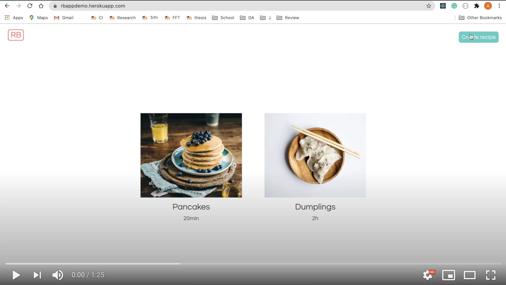

## Description:

#### Technologies and tools used:

- React
- Redux
- Typescript
- Node.js
- Mongo DB
- Express.js
- Cypress.io
- Sass
- Heroku

### What I learned:

I learned how Redux works and how to deal with file uploads. In addition, I learned how to write end-to-end tests with Cypress. I also practiced TypeScript, Node.js and React skills.

### App functionality overview:

The app allows to create recipes and review them.

How to use the app:

- on the home page you can see recipes added by others
- click on a recipe to see its details
- to create a recipe, click "Create recipe" in the upper right corner
- fill in the form and click "Submit" to add your recipe to the common list
- to go back the the recipe list, bress "Go back" in the upper right corner

### Demo link

[Click to go to live demo](https://rbappdemo.herokuapp.com/).

### Video demo: (click the image below to play)

## How to get the app locally

- **`git clone https://github.com/AnyaSen/Recipe-book.git`**

- **`npm install`**

- **`cd frontend`** + **`npm install`**

### Commands:

- to run locally: **`npm run dev`** (from the root)
